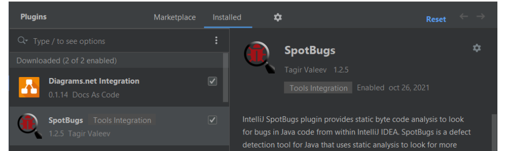

# OPTIMIZACIÓN

## 1. ¿Qué se entiende por hendiodez del código? Pon al menos 5 ejemplos.

- La hediondez del código (code smell en inglés) se refiere a una serie de señales o indicadores que sugieren que un código fuente puede tener problemas de diseño o arquitectura que podrían afectar su calidad, mantenibilidad y escalabilidad. Algunos ejemplos comunes de hediondez del código son:
  1. Duplicación de código: cuando hay fragmentos de código repetidos en diferentes lugares del programa, lo que aumenta la complejidad y el riesgo de errores.
  2. Métodos o funciones demasiado largos: cuando una función o método es demasiado extenso y realiza múltiples tareas, lo que dificulta la lectura y el mantenimiento del código.
  3. Clases con demasiadas responsabilidades: cuando una clase tiene múltiples tareas o responsabilidades, lo que hace que sea difícil de entender, modificar y reutilizar.
  4. Mal uso de estructuras de datos: cuando se utilizan estructuras de datos ineficientes o inadecuadas para el problema en cuestión, lo que puede afectar el rendimiento y la escalabilidad del programa.
  5. Código poco legible o comentado: cuando el código es difícil de leer, no sigue convenciones de nomenclatura, o no está suficientemente documentado, lo que dificulta la comprensión y el mantenimiento.

## 2. ¿Qué tipo de herramienta utilizamos para hacer análisis estático del código?

- Para hacer análisis estático del código se utiliza una herramienta  llamada analizador de código estático. Este tipo de herramienta examina  el código fuente en busca de problemas como duplicación de código,  métodos o funciones demasiado largos, clases con demasiadas  responsabilidades, mal uso de estructuras de datos y código poco legible o comentado. Ejemplos populares de analizadores de código estático son  SonarQube, ESLint, Pylint, FindBugs y Checkstyle.

## 3. ¿Qué sitios web nos permiten hacer análisis estático del código o **Continuous Inspection**?

- Existen varias herramientas y sitios web que nos permiten hacer análisis estático del código o Continuous Inspection. Algunos de ellos son:
  1. SonarQube: Es una plataforma de análisis estático de código que ofrece una amplia gama de características para mejorar la calidad del código y detectar problemas. Soporta varios lenguajes de programación, como Java, C/C++, JavaScript, Python, entre otros.
  2. Codacy: Ofrece análisis de código estático y una amplia variedad de características para mejorar la calidad del código y la productividad del equipo. Soporta una gran variedad de lenguajes de programación.
  3. Code Climate: Ofrece análisis de código estático, medición de la complejidad del código y sugerencias para mejorar la calidad del código. Soporta varios lenguajes de programación, como Ruby, Python, JavaScript, entre otros.
  4. ESLint: Es una herramienta de análisis de código para JavaScript que ayuda a detectar errores y problemas en el código. Es altamente configurable y se puede integrar con varias herramientas de construcción y automatización de tareas.
  5. Pylint: Es una herramienta de análisis de código para Python que verifica el estilo y la calidad del código, y ayuda a detectar problemas y errores en el código.

## 4. Instala en IDEA el plugin SpotBugs, si no lo tienes aún instalado.

## 7. ¿Qué es la refactorización?
- La refactorización es una técnica utilizada en desarrollo de software para mejorar la calidad, legibilidad y mantenibilidad del código sin alterar su comportamiento externo. Se realiza con el objetivo de mejorar el diseño, eliminar código innecesario, mejorar el rendimiento y la eficiencia, y reducir la complejidad del código. Es una técnica que se puede aplicar en cualquier etapa del ciclo de vida del software y debe ser realizada de manera cuidadosa y planificada.

## 8. ¿Qué técnicas se utilizan a menudo a la hora de refactorizar?
- Existen diversas técnicas que se utilizan a menudo a la hora de refactorizar el código fuente de un programa. Algunas de las más comunes son:

    1. Extracción de métodos: consiste en extraer una sección de código que se repite varias veces dentro de una clase o método y convertirla en un método separado que pueda ser reutilizado en otras partes del programa.

    2. Renombrado de variables y métodos: consiste en cambiar los nombres de variables y métodos a nombres más descriptivos que reflejen mejor su función en el programa.

    3. Eliminación de código duplicado: consiste en eliminar secciones de código que se repiten innecesariamente en distintas partes del programa.

    4. Simplificación de estructuras de control: consiste en simplificar estructuras de control de flujo, como if/else, switch/case o bucles, para hacer el código más legible y fácil de entender.

    5. Separación de responsabilidades: consiste en dividir el código en módulos o clases más pequeñas y especializadas que se encarguen de tareas específicas, con el objetivo de mejorar la cohesión y reducir la complejidad del programa.